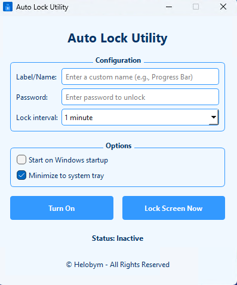

This software is developed by [Helobym](https://helobym.com)

Auto Lock Utility is a Windows desktop application designed to enhance computer security by automatically locking your screen after a specified time interval. This user-friendly tool helps prevent unauthorized access to your computer when you step away, making it ideal for both office and home environments.

Security is provided through a password system, where users set their own unlock password for accessing the computer after it's been locked. The utility offers flexible timing options ranging from 30 seconds to 3 days, allowing users to select the perfect auto-lock interval for their specific needs.

[Demo Video](https://youtu.be/Rusp3osBits)

